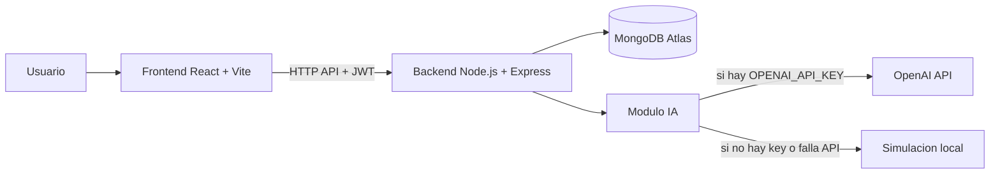

# NutriAI - Plataforma de Nutricion Preventiva con IA

NutriAI es una aplicacion web fullstack para gestion nutricional personalizada. Permite registrar comidas, visualizar metricas, generar planes alimenticios y conversar con un asistente de IA en base al perfil y al historial del usuario.

## Estado actual del proyecto

Implementado en esta version:

- Autenticacion completa con JWT (registro, login, rutas protegidas).
- Perfil nutricional editable (edad, peso, altura, genero, actividad, objetivo).
- Registro de comidas con macros (calorias, proteinas, carbos, grasas).
- Vista de consumo acumulado diario y panel con metricas.
- Generacion de plan alimenticio semanal.
- Chat de IA nutricional con contexto del usuario y comidas.
- Configuracion visual con modo claro/oscuro.
- Migracion de capa de datos de PostgreSQL/Sequelize a MongoDB/Mongoose.

## Arquitectura



### Frontend

- Stack: React 19, React Router, Tailwind CSS, Recharts, Axios.
- Estructura principal en `Frontend/src`:
  - `pages/`: Landing, Login, Register, Dashboard, MealRegister, MealPlan, AiAssistant, Profile, Statistics, Settings.
  - `components/Layout.jsx`: shell principal para rutas privadas.
  - `context/AuthContext.jsx`: sesion, token y cliente API.

### Backend

- Stack: Node.js, Express, Mongoose, JWT, bcryptjs, Axios.
- Archivo principal: `Backend/server.js`.
- Capa de acceso a datos: `Backend/db.js`.
- Modelos Mongo: `Backend/src/models` (`User`, `Meal`, `NutritionPlan`, `Counter`).
- Modulo IA: `Backend/ai.js`.

## Flujo funcional

1. Usuario se registra o inicia sesion.
2. Backend emite JWT y frontend lo guarda en `localStorage`.
3. Frontend consume endpoints protegidos con `Authorization: Bearer <token>`.
4. Comidas y perfil se guardan en MongoDB Atlas.
5. Plan semanal y chat usan el modulo IA con datos del usuario.

## Base de datos y migracion

El proyecto actualmente usa MongoDB (Atlas) con Mongoose.

- Se reemplazo la infraestructura SQL anterior.
- Se usa una coleccion `counters` para IDs incrementales (compatibilidad con IDs numericos previos).

## Endpoints principales

### Auth
- `POST /api/auth/register`
- `POST /api/auth/login`

### Usuario
- `GET /api/user/profile`
- `PUT /api/user/profile`

### Comidas
- `POST /api/meals`
- `GET /api/meals`

### Planes
- `GET /api/plans`
- `POST /api/plans/generate`

### IA
- `POST /api/ai/chat`

## Variables de entorno

Crear archivo `Backend/.env` con:

```env
PORT=5000
JWT_SECRET=coloca_un_secreto_fuerte
MONGODB_URI=tu_uri_mongodb_atlas
OPENAI_API_KEY=opcional
```

Notas:
- `OPENAI_API_KEY` es opcional. Si no esta definida, el modulo IA usa simulacion local.
- No subir `.env` al repositorio.

## Requisitos

- Node.js 20+ (recomendado 22 LTS).
- npm 10+.
- Acceso a MongoDB Atlas (o instancia Mongo compatible).

## Como ejecutar (desarrollo)

Abrir 2 terminales desde la raiz del proyecto.

### 1) Backend

```bash
cd Backend
npm install
npm run dev
```

Servidor API esperado en:
- `http://localhost:5000`

### 2) Frontend

```bash
cd Frontend
npm install
npm run dev
```

Aplicacion esperada en:
- `http://localhost:5173`

## Scripts utiles

### Backend

- `npm run dev`: inicia servidor Node.
- `npm start`: inicia servidor Node.

### Frontend

- `npm run dev`: inicia Vite en desarrollo.
- `npm run build`: build de produccion.
- `npm run preview`: previsualiza build.
- `npm run lint`: corre ESLint.

## Modo claro/oscuro

- Se controla desde Configuracion en la aplicacion.
- Persistencia en `localStorage` con la clave `nutriai_dark_mode`.
- El tema se aplica globalmente al cargar la app.

## Seguridad y recomendaciones

- Rotar credenciales si alguna URI o clave fue expuesta.
- Usar un `JWT_SECRET` robusto por entorno.
- Mover configuraciones sensibles a secretos del entorno (no hardcode).
- Para produccion, agregar rate limiting, validaciones adicionales y logs estructurados.

## Roadmap sugerido

- Integrar RAG para respuestas de IA con fuentes nutricionales verificables.
- Agregar testing (unitario e integracion) para backend y frontend.
- Dockerizacion y pipeline CI/CD.
- Observabilidad (health checks, metricas y trazas).
